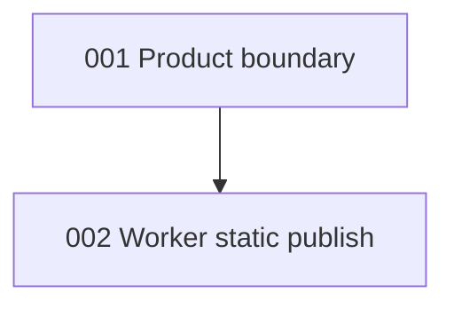

# ADR index

| # | Title | 中文 | Status | Layer |
|---|-------|------|--------|-------|
| [001](001-product-boundary.md) | Product boundary vs Invest 智报 / Radar / Founder | [产品边界](001-product-boundary.zh.md) | Accepted | Product / Worker + shell |
| [002](002-worker-publish-static-ui.md) | Worker publish path — static Idea artifacts for UI | [Worker 静态发布路径](002-worker-publish-static-ui.zh.md) | Accepted | Worker / Frontend / Data |

Next free number: **003**.
